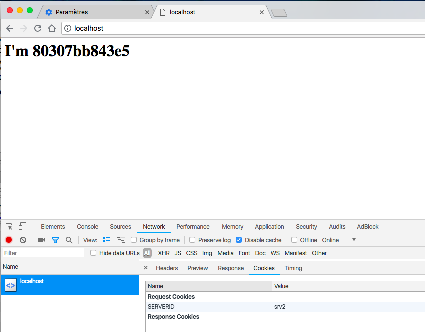

# Labo - Infrastructure HTTP

Bref rappel des objectifs du laboratoire (*tiré du repo de base*) : 

*The first objective of this lab/TE is to get familiar with software tools that will allow us to build a **complete web infrastructure**. By that, we mean that we will build an environment that will allow us to serve **static and dynamic content**to web browsers. To do that, we will see that the **apache httpd server** can act both as a **HTTP server** and as a **reverse proxy**. We will also see that **express.js** is a JavaScript framework that makes it very easy to write dynamic web apps.*

*The second objective is to implement a simple, yet complete, **dynamic web application**. We will create **HTML**, **CSS** and **JavaScript** assets that will be served to the browsers and presented to the users. The JavaScript code executed in the browser will issue asynchronous HTTP requests to our web infrastructure (**AJAX requests**) and fetch content generated dynamically.*

*The third objective is to learn to use **Docker**. All the components of the web infrastructure will be packaged in custom Docker images (we will create at least 3 different images).*

## Step 1 - Static Apache

L'objectif de cette première partie est de mettre en place un serveur HTTP Apache en utilisant Docker. Nous verrons donc comment configurer, puis compiler une image Docker qui exécute un tel serveur.

### Configuration

```console
cdb@rigel$ cat Dockerfile

# Choix de l'image à utiliser pour notre container
FROM php:5.6-apache

# Assez explicite, on copie le contenu du répertoire local "content" vers le répertoire du container "/var/www/html"
COPY content /var/www/html
```

### Compilation

```console
cdb@rigel$ docker build -t apache-static .
Sending build context to Docker daemon  6.349MB
Step 1/2 : FROM php:5.6-apache
 ---> 0a23a2f270f4
Step 2/2 : COPY content /var/www/html
 ---> 0172e9b7b542
Successfully built 0172e9b7b542
```

### Exécution

Pour l'exécution de notre image, on utilise la commande **docker run** à laquelle on passe en paramètre l'option **-d** pour que le container s'exécute en tâche de fond, ainsi que l'option **-p 80:80** pour indiquer à Docker qu'on souhaite mapper le port 80 de la machine hôte vers le port 80 du container. 

Enfin le dernier argument est simplement le nom de l'image que nous avons préparé.

```console
cdb@rigel$ docker run -d -p 80:80 apache-static

1c4c793dbc81b5a507cba45c6b9b967914444cd7cad97a2ea496bd683dfa999f
```

```console
cdb@rigel$ docker ps

CONTAINER ID      IMAGE            COMMAND                  PORTS                NAMES
9ba7d7a4cbe9      apache-static    "docker-php-entrypoi…"   0.0.0.0:80->80/tcp   infallible_nobel
```

### Test

En accédant à la page **http://localhost** dans un navigateur on tombe bel et bien sur notre template HTML.


### Configuration d'Apache2

Pour voir de plus près la configuration Apache2, il faut d'abord entrer dans le container. Pour cela nous allons avoir besoin du nom du container que nous venons de lancer. La commande **docker ps** nous fournit cette information

```console
cdb@rigel$ docker exec -it infallible_nobel /bin/bash

root@9ba7d7a4cbe9:/var/www/html#
```

A partir de là on peut aller founier dans les fichiers de configuration d'Apache2 qui sont situés dans le répertoire **/etc/apache2/** du container.

Une partie de l'output a volontairement été caché pour ne pas surcharger le document, l'idée étant d'avoir une vue d'ensemble.

```console
root@9ba7d7a4cbe9:/etc/apache2# ls -Rl
.:
total 72
-rw-r--r-- 1 root root  7115 Mar 31 09:17 apache2.conf
drwxr-xr-x 1 root root  4096 Apr 30 22:23 conf-available
drwxr-xr-x 1 root root  4096 Apr 30 22:23 conf-enabled
-rw-r--r-- 1 root root  1924 Apr 30 22:23 envvars
-rw-r--r-- 1 root root 31063 Mar 30 15:07 magic
drwxr-xr-x 1 root root  4096 May  5 02:09 mods-available
drwxr-xr-x 1 root root  4096 May  5 02:09 mods-enabled
-rw-r--r-- 1 root root   320 Mar 30 15:07 ports.conf
drwxr-xr-x 2 root root  4096 Apr 30 22:23 sites-available
drwxr-xr-x 2 root root  4096 Apr 30 22:23 sites-enabled

./conf-available:
total 24
-rw-r--r-- 1 root root  315 Mar 30 15:07 charset.conf
-rw-r--r-- 1 root root  204 Apr 30 22:23 docker-php.conf
-rw-r--r-- 1 root root 3224 Mar 30 15:07 localized-error-pages.conf
-rw-r--r-- 1 root root  189 Mar 30 15:07 other-vhosts-access-log.conf
-rw-r--r-- 1 root root 2190 Mar 31 09:17 security.conf
-rw-r--r-- 1 root root  455 Mar 30 15:07 serve-cgi-bin.conf

./conf-enabled:
total 0
lrwxrwxrwx 1 root root 30 Apr 30 22:23 charset.conf -> ../conf-available/charset.conf
lrwxrwxrwx 1 root root 33 Apr 30 22:23 docker-php.conf -> ../conf-available/docker-php.conf
...

./mods-available:
total 532
-rw-r--r-- 1 root root  100 Mar 30 15:07 access_compat.load
-rw-r--r-- 1 root root  377 Mar 30 15:07 actions.conf
-rw-r--r-- 1 root root   66 Mar 30 15:07 actions.load
-rw-r--r-- 1 root root  843 Mar 30 15:07 alias.conf
...

./mods-enabled:
total 0
lrwxrwxrwx 1 root root 36 Apr 30 22:23 access_compat.load -> ../mods-available/access_compat.load
lrwxrwxrwx 1 root root 28 Apr 30 22:23 alias.conf -> ../mods-available/alias.conf
lrwxrwxrwx 1 root root 28 Apr 30 22:23 alias.load -> ../mods-available/alias.load
...

./sites-available:
total 12
-rw-r--r-- 1 root root 1332 Mar 30 15:07 000-default.conf
-rw-r--r-- 1 root root 6437 Mar 31 09:17 default-ssl.conf

./sites-enabled:
total 0
lrwxrwxrwx 1 root root 35 Apr 30 22:23 000-default.conf -> ../sites-available/000-default.conf
root@9ba7d7a4cbe9:/etc/apache2# 

```

Parmis ces fichiers on peut regarder de plus près le contenu du fichier **ports.conf** qui définit les ports d'écoute du serveur HTTP de manière globale.

```bash 
root@9ba7d7a4cbe9:/var/www/html# cat /etc/apache2/ports.conf 

Listen 80
<IfModule ssl_module>
	Listen 443
</IfModule>
<IfModule mod_gnutls.c>
	Listen 443
</IfModule>
```

Ou encore le fichier **apache2.conf**, qui est le fichier de configuration globale d'Apache2. A noter qu'une grande partie des lignes à été retiré pour les mêmes raisons que précédemment.

```console
root@9ba7d7a4cbe9:/etc/apache2# cat apache2.conf 
...
#	/etc/apache2/
#	|-- apache2.conf
#	|	`--  ports.conf
#	|-- mods-enabled
#	|	|-- *.load
#	|	`-- *.conf
#	|-- conf-enabled
#	|	`-- *.conf
# 	`-- sites-enabled
#	 	`-- *.conf

...

#
# Timeout: The number of seconds before receives and sends time out.
#
Timeout 300

...
ErrorLog ${APACHE_LOG_DIR}/error.log

...
LogLevel warn

# Include module configuration:
IncludeOptional mods-enabled/*.load
IncludeOptional mods-enabled/*.conf

# Include list of ports to listen on
Include ports.conf

...
<Directory /var/www/>
	Options Indexes FollowSymLinks
	AllowOverride None
	Require all granted
</Directory>

# AccessFileName: The name of the file to look for in each directory
# for additional configuration directives.  See also the AllowOverride
# directive.
#
AccessFileName .htaccess

#
# The following lines prevent .htaccess and .htpasswd files from being
# viewed by Web clients.
#
<FilesMatch "^\.ht">
	Require all denied
</FilesMatch>

...
LogFormat "%v:%p %h %l %u %t \"%r\" %>s %O \"%{Referer}i\" \"%{User-Agent}i\"" vhost_combined
LogFormat "%h %l %u %t \"%r\" %>s %O \"%{Referer}i\" \"%{User-Agent}i\"" combined
LogFormat "%h %l %u %t \"%r\" %>s %O" common
LogFormat "%{Referer}i -> %U" referer
LogFormat "%{User-agent}i" agent

# Include of directories ignores editors' and dpkg's backup files,
# see README.Debian for details.

# Include generic snippets of statements
IncludeOptional conf-enabled/*.conf

# Include the virtual host configurations:
IncludeOptional sites-enabled/*.conf
```

En conclusion, nous avons montré : 

* comment construire une image Docker avec un serveur Apache et un joli template HTML
* comment lancer un container en utilisant l'image construite et accéder au contenu depuis un navigateur
* comment accéder au container en ligne de commande pendant son exécution


## Step 2 (a) - NodeJS app

Le but de cette partie est de :

* mettre en place une application NodeJS
* construire une image Docker pouvant exécuter notre application
* lancer le container avec l'image en question et montrer que le contenu est généré dynamiquement

### Configuration de l'image 'js-express'

On utilise la version 4.4 de NodeJS, on copie également les sources de notre application directement dans le répertoire **/opt/app** de notre container et enfin, on fourni la commande à exécuter par le container à la fin de son initialisation.

```console
cdb@rigel$ cat Dockerfile

FROM node:4.4
COPY src /opt/app
CMD ["node", "/opt/app/index.js"]
```

### Application Node.js

Conformément à ce qui montré dans le webcat de M. Liechti, nous avons utilisé le module **Chance** pour générer des données factices, en l'occurence des étudiants. Dans notre cas, nous l'avnos légèrement modifiée pour générer des animaux, des pays et des villes.

A noter également que nous définissons dans cette application des URL spécifiques qui vont appeler une fonction de callback selon l'URL appelée. 

On voit que l'appel de **"/"** utilise la fonction de callback **generateAnimals**, mais on voit également que l'appel de l'URL **"/test"** enverra la chaîne **Test RES**. 

On a donc bien une configuration qui nous permet de retourner un contenu différent selon l'URL défini dans la requête HTTP.

```js
var Chance = require('chance');
var chance = new Chance();

const express = require('express')
const app = express()

app.get('/', function (req, res) {
        res.send( generateAnimals() )
})

app.get('/test', function(req, res) {
  res.send('Test RES')
})

app.listen(3000, function () {
        console.log('Example app listening on port 3000!')
})


function generateAnimals() {

        var nbAnimals = chance.integer({
                min: 0,
                max: 10
        });

        console.log(nbAnimals);
        var animals = [];
        for (var i = 0; i < nbAnimals; i++) {

                animals.push({
                        animal: chance.animal(),
                        pays: chance.country({full: true}),
                        city: chance.city()
                });
        }

        console.log(animals)
        return animals;
}
```

### Dockerisation de l'application

Nous souhaitons à présent dockeriser cette application. Même démarche que pour l'étape 1, on va utiliser les commandes **docker build** suivi de **docker run**

#### build

```console
cdb@rigel$ docker build -t js-express .

Sending build context to Docker daemon  3.271MB
Step 1/3 : FROM node:4.4
 ---> 93b396996a16
Step 2/3 : COPY src /opt/app
 ---> Using cache
 ---> c478a2624ead
Step 3/3 : CMD ["node", "/opt/app/index.js"]
 ---> Using cache
 ---> 4f045413fae1
Successfully built 4f045413fae1
Successfully tagged js-express:lates
```

#### run

```console
cdb@rigel$ docker run -d -p 3000:3000 js-express

2a936bb6c58979216a36c73df13d97724c9c1eb20c11f841af2b0b135b11ee63
```

```console
cdb@rigel$ docker ps

CONTAINER ID        IMAGE          PORTS                    NAMES
2a936bb6c589        js-express     0.0.0.0:3000->3000/tcp   ecstatic_vaughan
```

Vérification faite, notre container tourne correctement et écoute sur le port 3000, passons au test de notre application. Ouvrons pour cela un nouvel onglet du terminal.

#### test

Pour le 1er test, on va tester le point d'entrée de notre application **http://localhost:3000/**, via l'outil *curl*

```console
cdb@rigel$ curl http://localhost:3000 | jq

[
  {
    "animal": "Koala",
    "pays": "Grenada",
    "city": "Ozmuotu"
  },
  {
    "animal": "Tilefish",
    "pays": "Micronesia",
    "city": "Lisobo"
  },
  {
    "animal": "Duck",
    "pays": "Micronesia",
    "city": "Ofnikoja"
  },
  {
    "animal": "Dogs",
    "pays": "Tonga",
    "city": "Resfiah"
  },
  {
    "animal": "Mule",
    "pays": "French Polynesia",
    "city": "Dubbougo"
  }
]

```

*A noter que j'utilise l'outil **jq** pour formater le JSON afin qu'il soit plus agréable à lire*

2ème test, l'URL **"/test"**. Cette fois on test en utilisant l'outil **telnet** pour voir l'entête HTTP.

```console
cdb@rigel$ telnet localhost 3000

Trying ::1...
Connected to localhost.
Escape character is '^]'.
GET /test HTTP/1.0

HTTP/1.1 200 OK
X-Powered-By: Express
Content-Type: text/html; charset=utf-8
Content-Length: 8
ETag: W/"8-IJ0qG21mAQsU5YlB7Ac75vH9dDI"
Date: Wed, 06 Jun 2018 16:00:44 GMT
Connection: close

Test RES
Connection closed by foreign host.
```

Parfait ! Notre application se comporte comme attendu.

Remarque concernant un point dans la vidéo **Labo HTTP (2b)** : nous ne somme malheureusement pas parvenu à communiquer avec le container en utilisant la commande telnet depuis la docker-machine.

En conclusion nous avons montré comment combiner les données générées dynamiquement par notre application NodeJS avec une page HTML statique en mettant en place des requêtes HTTP asynchrone entre les containers Docker. 


## Step 3 - Reverse proxy

Pour cette 3ème partie, le parti a été pris de ne pas utiliser le module proxy d'Apache pour mettre en place le reverse proxy. A la place, nous avons décidé d'utiliser HAProxy.


Voici la structure que nous avons ; 2 fichiers que nous allons détailler individuellement

```console
-rwxr-xr-x   1 lapin  staff   541B  7 jui 17:31 docker-compose.yml
-rwxr-xr-x   1 lapin  staff   358B  7 jui 17:44 haproxy.cfg
```

##### docker-compose.yml

Ce fichier est un fichier de configuration au format YAML qui permet de définir les différents services à instancier avec leurs paramètres respectifs. L'idée de Docker-composer étant d'éviter de devoir lancer chaque container manuellement. Docker-composer le fera pour nous sur la base de ce fichier. Dans notre cas nous définissons 3 images :

* 1ère : l'image **Apache statique** que nous avons utilisé dans la 1ère partie du laboratoire. 

* 2ème : l'image **JS-express** qui exécute notre application NodeJS de la 2ème partie du laboratoire ; à noter que nous apportons une légère adaptation dans le code de notre application pour mapper les requêtes effectuées sur l'URL **/api/express** sur la fonction de callback **generateAnimals** (précédemment mappé sur **/**)

  ```js
  app.get('/api/express', function (req, res) {
    res.send( generateStudents() )
  })
  
  app.listen(3000, function () {
    console.log('Example app listening on port 3000 !')
  })
  ```

  3ème : l'image **HAProxy** dont nous avons défini les paramètres dans le fichier Dockerfile juste avant et dont l'objectif sera de dispatcher les requêtes au bon container sur la base de l'URL request.

A noter que pour chaque service nous définissons les ports à mapper entre l'hôte et le guest, cela correspond en fait au paramètre **-p** **[ src_port:src_dst ]** qui est utilisé avec la commande docker run.

Dernier élément important ; notez la présence de **"volumes"** dans le service haproxy, ce dernier va permettre de monter la configuration HAProxy (**haproxy.cfg**) dans le répertoire **/usr/local/etc/haproxy** du container. (Nous détaillons la dite configuration juste après).

```yaml
version: '2'

services:
  app1: # Service 1
    image: res/apache_static # PHP and Apache
    container_name: 'app1'  # Name of the container

  app2: # Service 2
    image: node-express
    container_name: 'app2'

  haproxy:  # Haproxy service
    image: haproxy-reverse  # Official HAProxy image
    ports:
      - 80:80
    container_name: 'haproxy' # Name of the container
    volumes:  # HAProxy configuration volume mount 
      - './haproxy.cfg:/usr/local/etc/haproxy/haproxy.cfg:ro'
```

##### haproxy.cfg

La configuration de HAProxy est très simple ; on définit notre *frontend* qui correspond au point d'entrée ainsi que les *backends* qui correspondent aux services sous-jacents (dans notre cas JS-express et Apache)

Concernant les *backends* on en définit 2, 1 pour chaque service. Et c'est ici précisément que nous faisons abstraction du problème des adresses IP des containers ! En effet, le lien est fait sur la base du nom du service que nous avons justement défini dans le fichier docker-composer.yml ainsi que le numéro de port du service ! 

Ainsi **app1** référence le container avec le service Apache, et **app2** le container avec notre application Node

Maintenant que nos *backends* sont définis, il ne nous reste plus qu'à définir comment on souhaite dispatcher les requêtes vers l'un ou l'autres des *backends*. Dans le cadre de cette étape, on nous demande de mapper l'URL de base **"/"** sur le backend Apache statique et de mapper l'URL **"/api/express"** (cette dernière URL a cependant été choisi par nos soins) vers notre application Node.

Ce comportement est défini dans la partie *frontend* :

* Le point d'entrée devra écouter sur le port 80
* L'application par défaut est Apache
* Si la request URL contient **"/api/express"** alors on mappe la requête vers l'application Node

```
global
        debug

defaults
        log global
        mode    http
        timeout connect 5000
        timeout client 5000
        timeout server 5000

frontend main
        bind *:80
        default_backend app1
	    acl apiurl path_beg /api/express
        use_backend app2 if apiurl

backend app1
        server srv1 app1:80

backend app2
	    server srv2 app2:3000
```

Bien, nos trois fichiers de configurations sont prêts ! Nous allons pouvoir déployer les différents services très confortablement grâce à Docker-compose.

#### build & run

```console
cdb@rigel$ docker-composer up -d

Creating network "reverse-proxy_default" with the default driver
Creating app1    ... done
Creating haproxy ... done
Creating app2    ... done
```

Un petit coup de **docker ps** pour contrôler nos instances ; on constate qu'on a bien nos trois containers qui sont démarrés.

```console
CONTAINER ID        IMAGE               STATUS              PORTS                NAMES
d487abc510ca        node-express        Up About a minute                        app2
abf477c65f97        haproxy-reverse     Up About a minute   0.0.0.0:80->80/tcp   haproxy
7412311c500e        res/apache_static   Up About a minute   80/tcp               app1
```

On souhaite maintenant tester le comportement pour nous assurer que cela fonctionne comme nous le souhaitons. Pour effectuer les tests nous utilisons cette fois exclusivement **curl** par commodité, aussi pour avoir un affichage plus clair, nous nous contentons d'afficher les entêtes de la réponse. 

#### test

```console
cdb@rigel$ curl -I http://localhost/

HTTP/1.1 200 OK
Date: Sat, 09 Jun 2018 13:26:57 GMT
Server: Apache/2.4.10 (Debian)
Last-Modified: Thu, 03 May 2018 19:35:17 GMT
ETag: "2b6e-56b524d9a4740"
Accept-Ranges: bytes
Content-Length: 11118
Vary: Accept-Encoding
Content-Type: text/html

-----------------------

cdb@rigel$ curl -I http://localhost/api/express

HTTP/1.1 200 OK
X-Powered-By: Express
Content-Type: application/json; charset=utf-8
Content-Length: 295
ETag: W/"127-V5LwQiJjXoKROK8K1C9UcxWw27o"
Date: Sat, 09 Jun 2018 13:27:04 GMT
```

On constate qu'effectivement la première requête effectuée sur la base URL ( **"/"** ) contient dans le header HTTP de la réponse l'élément suivant : **Server: Apache/2.4.10 (Debian)** qui nous confirme que la requête a bel et bien été traité par notre instance Apache

Pour la deuxième requête on constate que l'entête diffère. On a notamment l'élément **X-Powered-By: Express** qui nous confirme que c'est notre application Node qui a répondu.

En conclusion, nous avons montré qu'il est possible de router l'utilisateur automatiquement vers tel ou tel noeud selon l'URL demandée dans la requête HTTP.


## Step 4 - AJAX requests

Ci-dessous, le code Javascript inclut dans le fichier HTML de notre page statique. Cette requête asynchrone aura pour but de récupérer des données dynamiques directement depuis l'application Node et d'afficher une entrée dans la page HTML sans rechargement de la page.

Une nouvelle requête AJAX est effectuée toute les deux secondes pour rendre le phénomène bien visible.

#### JS script

```php+html
<script type="text/javascript">
	
    // Wait for the page to be fully loaded
	$( document ).ready(function() {
    	setInterval("sendRequest()", 2000);
  	});

  	function sendRequest() {

    	// Perform Ajax request
    	$.ajax({
            url: '/api/express',
            type: 'GET',
            dataType: 'json',
            success: function(data) {
                $('#ajax-content').html("Hi ! Let me introduce me, i am : " + data[0].color + " " + data[0].animal + "</br>" + "I was born in " + data[0].birthYear + " and i live in : " + data[0].city);
            },
            error: function (xhr, ajaxOptions, thrownError) {
                var errorMsg = 'Ajax request failed: ' + xhr.responseText;
                $('#ajax-content').html(errorMsg);
            }
        });
    }

</script>
```

On remarque l'URL qui est défini dans notre requête AJAX : **/api/express** ainsi qu'il s'agit d'une requête de type GET.

#### Test

Parfait ! Les requêtes AJAX s'exécutent bien, on peut voir le contenu qui est rafraichi dynamiquement sans recharge de la page.


## Step 5 - Dynamic reverse proxy configuration

Pour la problèmatique exposée dans cette 5ème étape, nous avons en réalité déjà paré au problème lors de l'étape 3.

En fait, grâce à **Docker Compose** combiné à **HAProxy** nous sommes parvenus à nous défaire de la contrainte des adresses IP en définissant, au niveau de Docker, des noms de noeuds auxquels nous pouvons directement faire référence dans la configuration d'HAProxy.

 

## Load balancing - multiple server nodes

Pour mettre en place le load balancing j'ai pris le parti d'utiliser HAProxy en combinaison avec Docker Compose. 


#### Serveur HTTP Node.js

Premièrement un serveur HTTP dans son plus simple appareil, on le fait écouter sur le **port 8080**. La fonction de callback enverra basiquement l'ID du container grâce à la méthode **os.hostname**

```console
cdb@rigel$ nano src/index.js

var http = require('http');
var os = require('os');
http.createServer(function (req, res) {
    res.writeHead(200, {'Content-Type': 'text/plain'});
    res.end(`${os.hostname()}\n`);
}).listen(8080);
```

##### docker-compose.yml

A nouveau on utilise Docker Composer pour définir cette fois une *stack* qui va nous permettre de lancer avec une seule commande 21 instances d'un coup :

* une instance HAProxy qui fera office de load-balancer vers nos backends
* 10 instances Apache-static
* 10 instances Node-express

```console
version: '3'

services:
  node-http-server-8080:
   image: node-http-server-8080
   ports:
     - 8080
   environment:
     - SERVICE_PORTS=8080
   deploy:
     replicas: 10
     update_config:
       parallelism: 2
       delay: 10s
     restart_policy:
       condition: on-failure
       max_attempts: 3
       window: 120s
   networks:
     - web

  apache-static:
   image: apache-static
   ports:
     - 80
   environment:
     - SERVICE_PORTS=80
   deploy:
     replicas: 10
     update_config:
       parallelism: 2
       delay: 10s
     restart_policy:
       condition: on-failure
       max_attempts: 3
       window: 120s
   networks:
     - web

  proxy:
    image: dockercloud/haproxy
    depends_on:
      - node-http-server-8080
      - apache-static
    environment:
      - BALANCE=leastconn
    volumes:
      - /var/run/docker.sock:/var/run/docker.sock
    ports:
      - 80:80
    networks:
      - web
    deploy:
      placement:
        constraints: [node.role == manager]

networks:
  web:
    driver: overlay
```

#### Build & run

Lancement de la stack

```console
cdb@rigel$ docker stack deploy --compose-file=docker-compose.yml prod

CONTAINER ID      IMAGE                          PORTS              NAMES
4a3f53269a8e      dockercloud/haproxy:latest     80/tcp, 443/tcp,..	prod_proxy.1.r0qa4hxicw8rpzcn
442fd99160a3      apache-static:latest           				   prod_apache-static.9.l4dl4py6
93076b041d51      apache-static:latest                              prod_apache-static.1.6yb2by2t
18f214ad3e9c      apache-static:latest                              prod_apache-static.2.any592kn
60fca53a3f86      apache-static:latest                              prod_apache-static.6.qx5g44dj
e8110d7c91c6      apache-static:latest                              prod_apache-static.4.s1a0uv0d
5e6b9f2b7b7b      apache-static:latest                              prod_apache-static.10.c5fmrqr
c728530fc2bc      apache-static:latest                              prod_apache-static.7.iy0fafrs
d6703280d981      apache-static:latest                              prod_apache-static.8.8830bywg
0320297a3b28      apache-static:latest                              prod_apache-static.3.u41kiciy
f7e9708b2552      apache-static:latest                              prod_apache-static.5.9y8ee7mh
52c469b97229      node-http-server-8080:latest                      prod_node-http-server-8080.7.
33085bcb92c0      node-http-server-8080:latest                      prod_node-http-server-8080.1.
8468f758f520      node-http-server-8080:latest                      prod_node-http-server-8080.10
dd79fbe52063      node-http-server-8080:latest                      prod_node-http-server-8080.8
1450c51da94b      node-http-server-8080:latest                      prod_node-http-server-8080.5
bbf510fcdec4      node-http-server-8080:latest                      prod_node-http-server-8080.2
783faa3f93e4      node-http-server-8080:latest                      prod_node-http-server-8080.4
6ab5232630d7      node-http-server-8080:latest                      prod_node-http-server-8080.6
579e9c695523      node-http-server-8080:latest                      prod_node-http-server-8080.9
f1af330f5a46      node-http-server-8080:latest                      prod_node-http-server-8080.3
```

#### Test

Nous souhaitons maintenant tester la robustesse de notre infrastructure et lui soumettre un stress test afin de voir notre load-balancer à l'oeuvre.

Pour les besoins de notre test, l'application dynamique **node-express** a été modifié pour renvoyer le container ID en lieu et place du tableau d'animaux au format JSON que nous avions mis en place lors de la seconde étape.

Quant à lui, le serveur HTTP NodeJS retourne également le container ID. Cela nous permettra de comparer le nombre de requêtes traitées par chaque instance.

Ci-dessous un simple script bash qui m'a permis de lancer de nombreuses requêtes en parallèle.

```bash
#!/bin/bash

URL=http://localhost
for i in {1..1000}
do
	curl "$URL" &
done
wait
```

En deux étapes, le script est lancé et sa sortie standard redirigée vers un fichier intermédiaire, puis le contenu est pipé vers *sort* puis *uniq*

```console
cdb@rigel$ ./test-lb.sh > benchmark-result
cdb@rigel$ cat benchmark-result | sort -nr | uniq -c
  36 94244355f56d
  36 7252f72cd164
  38 4030dcd619fc
  37 60e3956ec3a2
  38 43ad03eb0e17
  37 40a72bf17532
  36 23faf6a4593f
  36 7b8e01f32e0f
  38 2c833af5fef9
  38 2a729b8b9752
  37 1c8fe3864fc5
  37 eaedefe2285a
  37 d50ca203bbc7
  37 d15f797d550f
  37 d05f6c9d6149
  38 c0a7d96310ef
  38 bcd643c74e04
  37 b6734a3bba42
  36 b47e099c68df
  38 a020497658a5
  ..
```

Le résultat nous permet de voir que :

* l'ensemble des serveurs backend ont été mis à contribution par le load-balancer
* que HAProxy a dispatché les requêtes de manière équitables vers chacun des noeuds

En conclusion, nous avons un système de load-balancing très efficace et stable avec une configuration relativement simple et un temps de déploiement particulièrement court.


## Load balancing - Round-robin vs Sticky sessions

Pour commencer, un bref rappel de ce qu'est le round-robin et les sticky-sessions et dans quels cas on préfère l'un ou l'autre.

Premièrement le *Round-robin* est un algorithme qui permet d'ordonancer les requêtes. Cela fonctionne sur la base d'une file circulaire qui contient chaque noeud.

Deuxièmement, les *Sticky sessions*, à quoi ça sert ? Ce qu'il faut savoir c'est que souvent, lorsqu'on utilise une application web ou site, il y a une notion de session, par exemple lorsqu'un utilisateur se loggue sur le site en question, le site génère une session dans laquelle il va stocker différentes informations notamment le fait qu'il est loggué, cela lui permet de naviguer entre les pages sans avoir à se relogguer à chaque fois ! La session sert à se souvenir de ce genre d'information. 

Bien sur, cela fonctionne parfaitement lorsqu'il n'y a qu'un seul serveur qui sert les requêtes ! Or dans le cas du load-balancing le problème qui se pose est que la session peut avoir été initialisée sur un des noeuds mais pas forcément sur les autres instances. Pour palier à ce problème il faudrait répliquer les sessions entre les différents noeuds afin d'être cohérent entre les instances, sauf que ça n'est pas une super idée de tenter de synchroniser les sessions entre les noeuds pour différentes raisons que je ne vais pas développer ici. Toujours est-il que pour assurer un bon fonctionnement de l'application web et une expérience utilisateur optimale, on souhaite qu'un utilisateur ayant été servi par un serveur soit toujours servi par le même. D'où la notion de *Sticky sessions* ou *sessions collantes*.

### Round-Robin

Pour mettre en place le load-balancing avec un comportement Round-Robin nous utilisons à nouveau *HAProxy* qui permet de le faire très simplement.

##### docker-compose.yml

Là encore, on a la même configuration de base que pour l'étape 3, je ne vais par conséquent pas redétailler les différents points

```console
version: '2'

services:
  app1: # Service 1
    image: res/apache_static # PHP and Apache
    container_name: 'app1'  # Name of the container

  app2: # Service 2
    image: res/node-http-server
    container_name: 'app2'

  haproxy:  # Haproxy service
    image: haproxy  # Official HAProxy image
    ports:
      - 80:80
    container_name: 'haproxy' # Name of the container
    volumes:  # HAProxy configuration volume mount 
      - './haproxy.cfg:/usr/local/etc/haproxy/haproxy.cfg:ro'  
```

##### haproxy.cfg

La configuration de HAProxy est très similaire a ce qu'on avait vu dans l'étape 3 à l'exception de la partie *backend* qui est groupé en un seul backend et comporte maintenant le paramètre **balance roundrobin**. Plutôt explicite, cela va spécifier à HAProxy qu'il doit utiliser l'algorithme en question pour balancer la charge entre les deux noeuds, en l'occurence **app1** et **app2** que nous avons défini dans le fichier **docker-compose.yml**.

```console
global
        debug

defaults
        log global
        mode    http
        timeout connect 5000
        timeout client 5000
        timeout server 5000

frontend main
        bind *:80
        default_backend app

backend app
        balance roundrobin
        mode http
        server srv1 app1
        server srv2 app2
```

#### Build & run

Une fois nos deux fichiers de configuration en place, il ne nous reste plus qu'à monter les containers

```console
cdb@rigel$ docker-compose up -d

Creating network "round-robin_default" with the default driver
Creating haproxy ... done
Creating app1    ... done
Creating app2    ... done
```

#### Test

Pour tester nous avons effectuer une multitude de requêtes séquentielles en utilisant *curl.* on constate que le comportement attendu est bien celui du Round-Robin ! Chaque noeud sert les requêtes tour à tour.

```console
cdb@rigel$ curl -I http://localhost
HTTP/1.1 200 OK
Content-Type: text/html
Date: Sun, 10 Jun 2018 10:14:44 GMT

cdb@rigel$ curl -I http://localhost
HTTP/1.1 200 OK
Date: Sun, 10 Jun 2018 10:14:50 GMT
Server: Apache/2.4.10 (Debian)
Last-Modified: Sat, 09 Jun 2018 16:39:13 GMT
ETag: "2c66-56e3828114e40"
Accept-Ranges: bytes
Content-Length: 11366
Vary: Accept-Encoding
Content-Type: text/html

cdb@rigel$ curl -I http://localhost
HTTP/1.1 200 OK
Content-Type: text/html
Date: Sun, 10 Jun 2018 10:14:52 GMT

cdb@rigel$ curl -I http://localhost
HTTP/1.1 200 OK
Date: Sun, 10 Jun 2018 10:14:53 GMT
Server: Apache/2.4.10 (Debian)
Last-Modified: Sat, 09 Jun 2018 16:39:13 GMT
ETag: "2c66-56e3828114e40"
Accept-Ranges: bytes
Content-Length: 11366
Vary: Accept-Encoding
Content-Type: text/html

cdb@rigel$ curl -I http://localhost
HTTP/1.1 200 OK
Content-Type: text/html
Date: Sun, 10 Jun 2018 10:14:56 GMT

cdb@rigel$ curl -I http://localhost
HTTP/1.1 200 OK
Date: Sun, 10 Jun 2018 10:14:57 GMT
Server: Apache/2.4.10 (Debian)
Last-Modified: Sat, 09 Jun 2018 16:39:13 GMT
ETag: "2c66-56e3828114e40"
Accept-Ranges: bytes
Content-Length: 11366
Vary: Accept-Encoding
Content-Type: text/html

cdb@rigel$ curl -I http://localhost
HTTP/1.1 200 OK
Content-Type: text/html
Date: Sun, 10 Jun 2018 10:14:57 GMT

```

On a donc bel et bien démontré que le Round Robin peut être configuré facilement grâce à HAProxy avec au moins 2 noeuds. Bien entendu cela peut être réalisé avec N noeuds en backend (avec N >= 2).

### Sticky sessions

Obtenir un comportement *Sticky sessions* avec HAProxy requiert quelques modifications dans sa configuration ; nous allons les passer en revue.

##### haproxy.cfg

La première partie de la configuration a volontairement été écarté car similiaire aux configurations précédentes. Aussi on souhaite se concentrer sur la partie *backend*.

```console
...

backend app
        balance roundrobin
	    option forwardfor
	    option http-server-close
	    cookie SERVERID insert indirect nocache
	    mode http
        server srv1 app1:80 check cookie srv1
        server srv2 app2:80 check cookie srv2
```

Première remarque, le paramètre **balance roundrobin** est toujours là ! La raison en est que session collantes ou non, il faut définir un load-balancing de base pour que les nouveaux clients soient dispatchés équitablement.

Deuxième remarque, l'option **cookie SERVERID insert indirect nocache** a fait son apparition ; concrètement cela va permettre de définir un cookie dans la navigateur du client lors de la sa première visite. Nous verrons juste après comment le vérifier.

Enfin, nous ajoutons **check cookie srv1** / **check cookie srv2** pour spécifier à HAProxy les noeuds concernés.

#### Tests

Pour nous assurer du bon fonctionnement des sessions nous créons un petit script PHP.

```php
<?php
    
header('Content-Type: text/plain');
session_start();
if(!isset($_SESSION['visit']))
{
        echo "This is the first time you're visiting this server";
        $_SESSION['visit'] = 0;
}
else
        echo "Your number of visits: ".$_SESSION['visit'];

$_SESSION['visit']++;

echo "\nServer IP: ".$_SERVER['SERVER_ADDR'];
echo "\nClient IP: ".$_SERVER['REMOTE_ADDR'];
echo "\nX-Forwarded-for: ".$_SERVER['HTTP_X_FORWARDED_FOR']."\n";

echo "<pre>";
print_r($_COOKIE);
echo "</pre>";

?>
```

Concrètement, ce script : 

* créer une session lors de la première visite
* incrémente la variable de session **visite** à chaque nouvelle visite
* affiche l'IP du serveur et l'IP du client
* affiche les cookies

Après N visites, on constate que c'est toujours le même serveur qui traite le serveur. C'est bien le comportement attendu.

```console
Your number of visits: 14
Server IP: 172.19.0.3
Client IP: 172.19.0.2
X-Forwarded-for: 172.19.0.1
Array
(
    [PHPSESSID] => 751e607667303af5b7feaa8c40f7bc40
)
```

Manipulation supplémentaire, nous souhaitons contrôler si un visiteur peut effectivement être servi par l'un ou l'autre s'il s'agit de sa première visite.

Pour le démontrer nous allons accéder à **http://localhost** puis vider le cache, supprimer les cookies du navigateur et retenter d'accéder à la même page

Premier accès, on tombe sur la 2ème application, on constate qu'un cookie **SERVERID** est défini avec la valeur **srv2**



On supprime les données de navigation


Puis on rente l'accès


Bingo ! On tombe cette fois l'autre application. On constate que le cookie **SERVERID** a cette fois la valeur **srv1** dans l'entête de la requête.

En conclusion on comprends que la notion de *Sticky session* est essentielle au bon fonctionnement des applications web qui utilise les sessions pour stocker diverses informations.


## Conclusion finale

En fin de compte, ce laboratoire était particulièrement intéressant et enrichissant dans le sens où il couvre un bon nombre d'aspects en les mettant tous en corélation et permettant ainsi de mieux cerner l'envergure et la puissance d'outils tel que **Docker**, **Docker Compose**, **HAProxy** mais également d'avoir une vue d'ensemble de toutes les technologies impliquées pour qu'une infrastructure web soit opérationnelle.


## Auteurs

* de Bourgues Cyril <cyril.debourgues@heig-vd.ch>

* Cerca Abrantes Silva Nuno Miguel <nuno.cercaabrantessilva@heig-vd.ch>